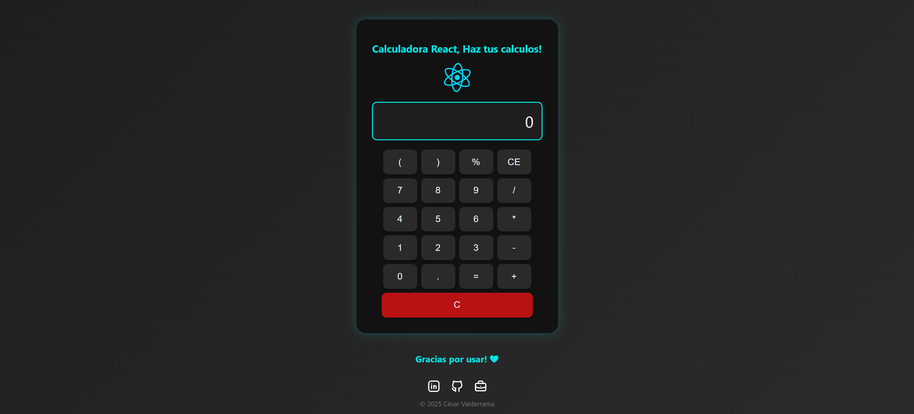

<h1 align="center">🧮 Calculadora React</h1> 
<p 
    align="center"> <b>Una calculadora moderna hecha con React.</b> <br/> Permite realizar  operaciones matemáticas básicas con una interfaz limpia, responsiva y funcional. 
</p>
<p align="center"> 
     
</p>

### https://calculadora-react-six-hazel.vercel.app/

---

🌟 Características

- ✅ Operaciones básicas: +, -, ×, ÷
- ✅ Diseño minimalista y adaptable
- ✅ Evaluación de expresiones con Math.js
- ✅ Botón de reinicio (C) y borrado total
- ✅ Componentes modulares y reutilizables

--- 

⚙️ Instalación
```bash
# Clona este repositorio
git clone https://github.com/tu-usuario/calculadora-react.git

# Entra en la carpeta del proyecto
cd calculadora-react

# Instala las dependencias
npm install

# Inicia el servidor de desarrollo
npm start
```
🖥️ Luego abre http://localhost:3000 en tu navegador.

---

🧩 Estructura del Proyecto
```
calculadora-react/
├── node_modules
├── public/
│   └── react.svg
│   └── view_calculadora.png
├── src/
│   ├── App.css
│   ├── App.jsx
│   └── main.jsx
├── .gitignore
├── eslint.config.js
├── index.html
├── package-look.json
├── package.json
├── README.md
└── vite.config.js
```

---

### 🧠 Conceptos de React aplicados

| Concepto |	Descripción |
|----------|----------------|
| useState |	Manejo de estado interno para la expresión y resultado |
| Props |	Comunicación entre componentes (Boton → App) |
| Eventos |	Escucha de clics en botones y actualización del estado |
| Render | dinámico	Muestra de valores en tiempo real |

---

### 💻 Tecnologías Utilizadas

| Tecnología |	Uso |
|------------|------|
| ⚛️ React |	Estructura de componentes |
| ⚡ Vite | Proyecto inicial rápido y ligero, bundler moderno para React y otras librerías |
| 🧮 Math.js |	Evaluación de operaciones |
| 🎨 CSS3 |	Estilos y animaciones |
| 💡 JavaScript (ES6+) |	Lógica y control de eventos |

---

💬 Autor

Desarrollado con ❤️ por `CesValde`